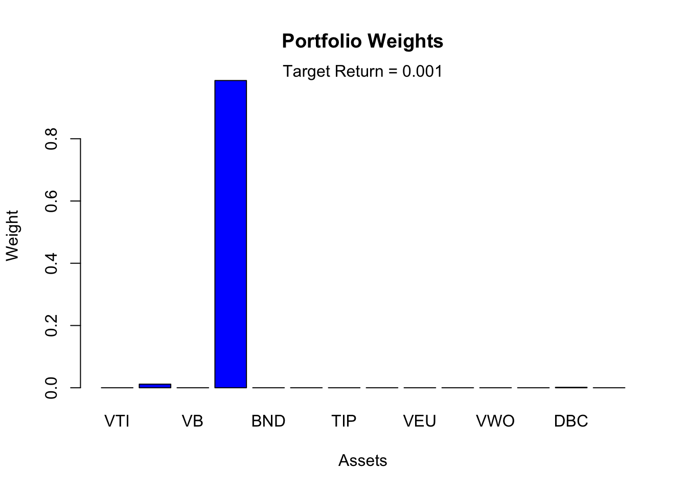
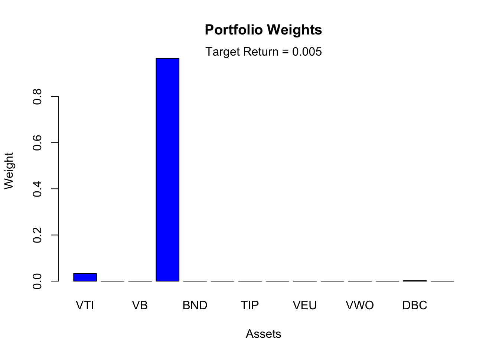
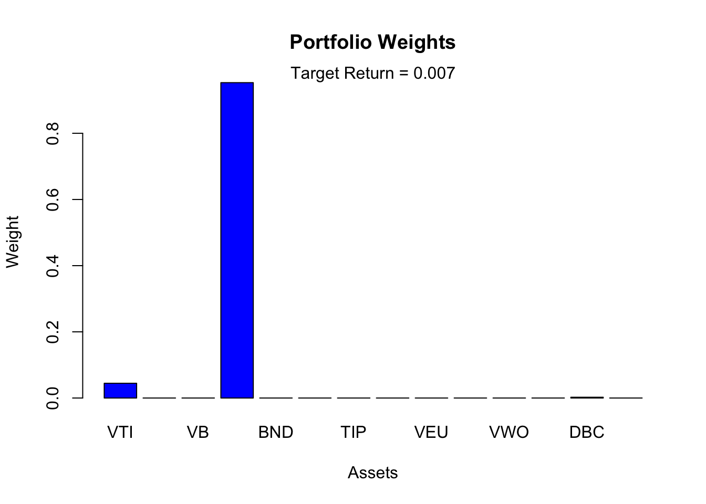
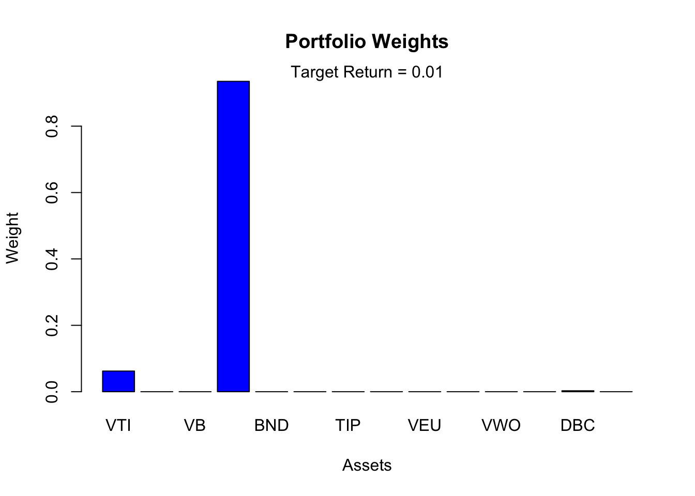
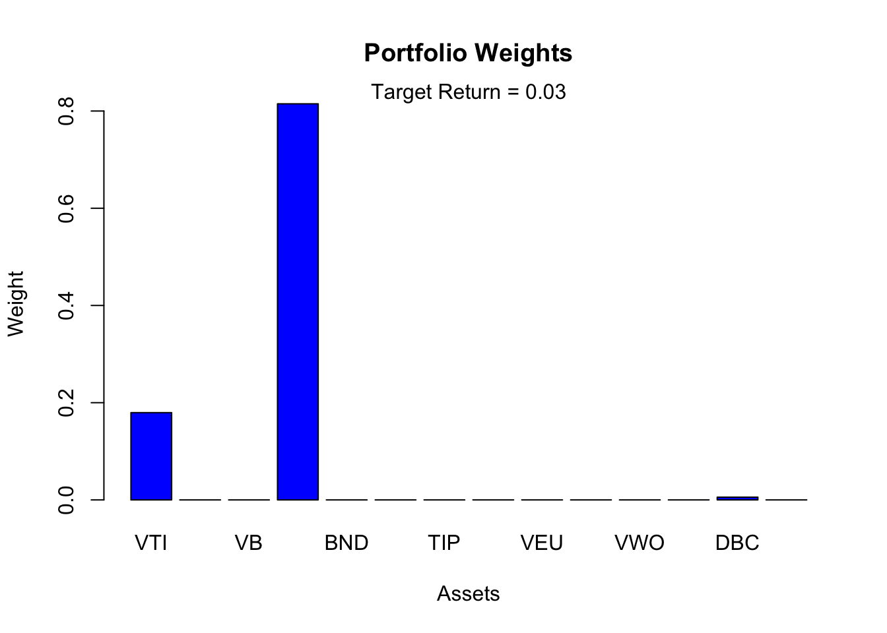
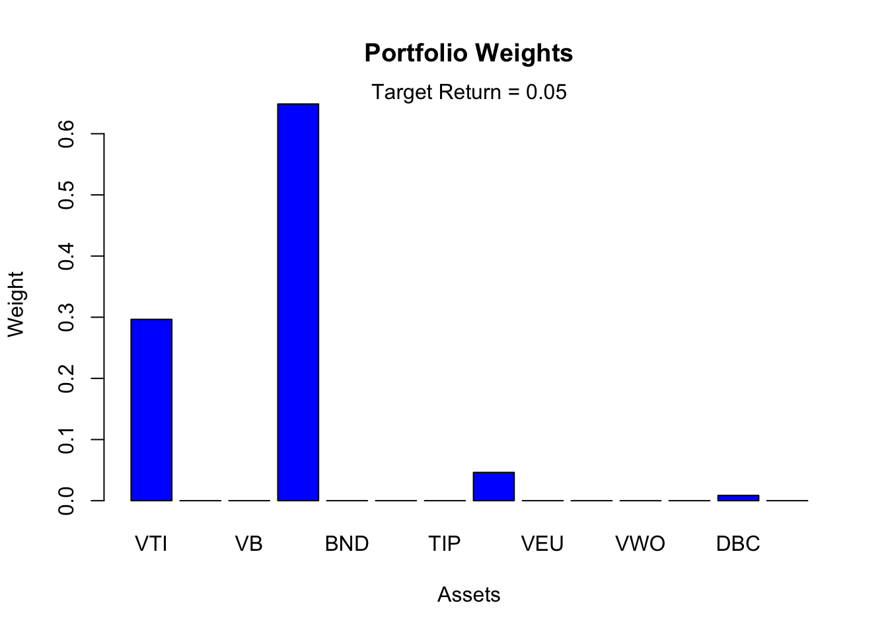
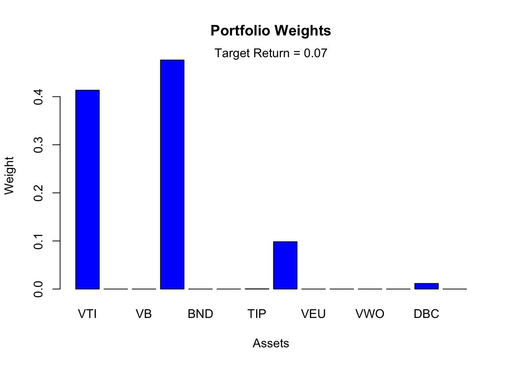
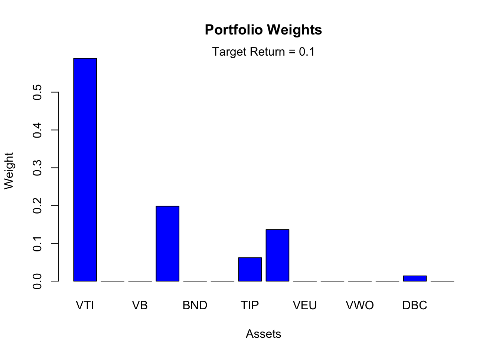
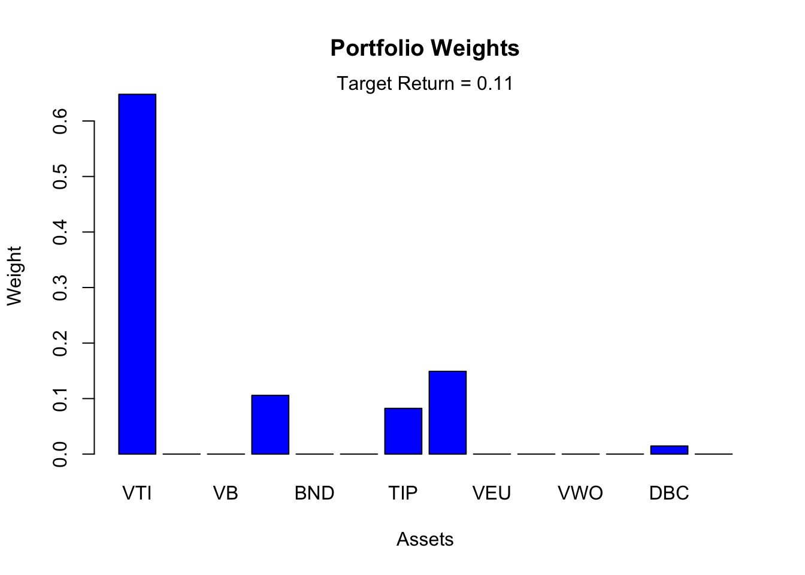
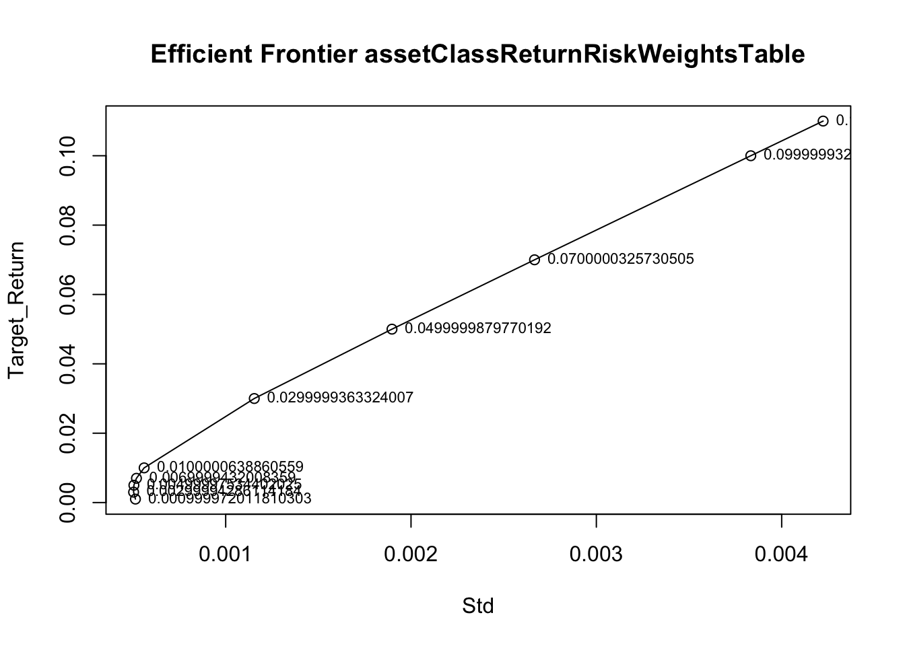

> Asset Class Allocation with Minimum-Variance Frontier Model
>
> *Glen Wang*
>
> *8/4/2018*
>
> Install and active packages

+-----------------------------------------------------------------------+
| > install.packages(\"devtools\")                                      |
+=======================================================================+
+-----------------------------------------------------------------------+

+-----------------------------------------------------------------------+
| > **library**(devtools)                                               |
+=======================================================================+
+-----------------------------------------------------------------------+

+-----------------------------------------------------------------------+
| > install.packages(\"IntroCompFinR\",                                 |
| > repos=\"http://R-Forge.R-project.org\")                             |
+=======================================================================+
+-----------------------------------------------------------------------+

+-----------------------------------------------------------------------+
| >                                                                     |
|  install_github(\"glenwang/R_MVFPortfolio/tree/master/MVFPortfolio\") |
+=======================================================================+
+-----------------------------------------------------------------------+

+-----------------------------------------------------------------------+
| > **library**(IntroCompFinR)                                          |
+=======================================================================+
+-----------------------------------------------------------------------+

+-----------------------------------------------------------------------+
| > **library**(MVFPortfolio)                                           |
+=======================================================================+
+-----------------------------------------------------------------------+

> Select date range and securities. Then fetch adjusted price data from
> Yahoo Finance.

+-----------------------------------------------------------------------+
| > begindate=\"2016-07-12\"                                            |
+=======================================================================+
+-----------------------------------------------------------------------+

+-----------------------------------------------------------------------+
| > sourc=\"yahoo\"                                                     |
+=======================================================================+
+-----------------------------------------------------------------------+

+-----------------------------------------------------------------------+
| > assetClassSymbols=c(\'VTI\',\'VO\',\'VB\',\'SHY\',\'BND\', \'TLT\', |
| > \'TIP\',\'MUB\',\'VEU\',\'VSS\',\'VWO\',\'VNQ\',\'DBC\',\'GLD\')    |
+=======================================================================+
+-----------------------------------------------------------------------+

+-----------------------------------------------------------------------+
| > assetClassPriceData=AdjustedPrice(assetClassSymbols, begindate,     |
| > sourc)                                                              |
+=======================================================================+
+-----------------------------------------------------------------------+

+-----------------------------------------------------------------------+
| > \## Downloading time series for symbol \'VTI\' \...                 |
+=======================================================================+
+-----------------------------------------------------------------------+

> \## \[1\] \"Merging VTI\$VTI.Adjusted\"
>
> \## Downloading time series for symbol \'VO\' \...
>
> \## \[1\] \"Merging VO\$VO.Adjusted\"
>
> \## Downloading time series for symbol \'VB\' \...
>
> \## \[1\] \"Merging VB\$VB.Adjusted\"
>
> \## Downloading time series for symbol \'SHY\' \...
>
> \## \[1\] \"Merging SHY\$SHY.Adjusted\"
>
> \## Downloading time series for symbol \'BND\' \...
>
> \## \[1\] \"Merging BND\$BND.Adjusted\"
>
> \## Downloading time series for symbol \'TLT\' \...
>
> \## \[1\] \"Merging TLT\$TLT.Adjusted\"
>
> \## Downloading time series for symbol \'TIP\' \...
>
> \## \[1\] \"Merging TIP\$TIP.Adjusted\"
>
> \## Downloading time series for symbol \'MUB\' \...
>
> \## \[1\] \"Merging MUB\$MUB.Adjusted\"
>
> \## Downloading time series for symbol \'VEU\' \...
>
> \## \[1\] \"Merging VEU\$VEU.Adjusted\"
>
> \## Downloading time series for symbol \'VSS\' \...
>
> \## \[1\] \"Merging VSS\$VSS.Adjusted\"
>
> \## Downloading time series for symbol \'VWO\' \...
>
> \## \[1\] \"Merging VWO\$VWO.Adjusted\"
>
> \## Downloading time series for symbol \'VNQ\' \...
>
> \## \[1\] \"Merging VNQ\$VNQ.Adjusted\"
>
> \## Downloading time series for symbol \'DBC\' \...
>
> \## \[1\] \"Merging DBC\$DBC.Adjusted\"
>
> \## Downloading time series for symbol \'GLD\' \...

+-----------------------------------------------------------------------+
| > \## \[1\] \"Merging GLD\$GLD.Adjusted\"                             |
+=======================================================================+
+-----------------------------------------------------------------------+

+-----------------------------------------------------------------------+
| > head(assetClassPriceData)                                           |
+=======================================================================+
+-----------------------------------------------------------------------+

+-----------------------------------------------------------------------+
| > \## VTI VO VB SHY BND TLT TIP                                       |
+=======================================================================+
+-----------------------------------------------------------------------+

> \## 2016-07-12 106.1270 124.2751 117.0650 83.23840 79.72051 132.8775
> 111.2006
>
> \## 2016-07-13 106.0693 124.1289 116.7236 83.25796 79.86233 134.4436
> 111.4390
>
> \## 2016-07-14 106.5797 124.5187 116.8797 83.20907 79.73943 132.4884
> 111.1529
>
> \## 2016-07-15 106.4641 124.4115 117.0162 83.16997 79.48409 131.3495
> 111.0289
>
> \## 2016-07-18 106.7626 124.6746 117.2406 83.21883 79.51246 131.2261
> 110.9526
>
> \## 2016-07-19 106.5508 124.3043 116.8211 83.22863 79.63538 131.9664
> 110.9621
>
> \## MUB VEU VSS VWO VNQ DBC GLD
>
> \## 2016-07-12 108.6325 41.71001 91.36580 34.65814 83.97759 15.10
> 127.15
>
> \## 2016-07-13 108.6133 41.65285 91.34656 34.60077 84.44212 14.91
> 128.32
>
> \## 2016-07-14 108.4891 42.05298 92.06772 35.07882 83.68958 14.97
> 127.33
>
> \## 2016-07-15 108.3745 41.84339 91.33696 34.95453 83.71744 14.93
> 126.84
>
> \## 2016-07-18 108.3458 42.01488 91.72156 35.26047 83.94043 14.86
> 127.04

+-----------------------------------------------------------------------+
| > \## 2016-07-19 108.3649 41.62426 91.15426 34.95453 84.34922 14.77   |
| > 127.21                                                              |
+=======================================================================+
+-----------------------------------------------------------------------+

+-----------------------------------------------------------------------+
| > tail(assetClassPriceData)                                           |
+=======================================================================+
+-----------------------------------------------------------------------+

+-----------------------------------------------------------------------+
| > \## VTI VO VB SHY BND TLT TIP MUB                                   |
+=======================================================================+
+-----------------------------------------------------------------------+

> \## 2018-07-27 145.22 161.63 158.16 83.052 78.82293 119.1935 111.2625
> 108.7610
>
> \## 2018-07-30 144.27 160.48 156.97 83.052 78.73314 118.7845 111.2027
> 108.6811
>
> \## 2018-07-31 145.09 161.63 158.50 83.052 78.79301 119.4330 111.3720
> 108.7410
>
> \## 2018-08-01 144.92 160.75 158.56 83.060 78.75000 118.4600 111.1000
> 108.5700
>
> \## 2018-08-02 145.78 161.81 159.91 83.110 78.79000 118.6300 111.1600
> 108.6800
>
> \## 2018-08-03 146.27 162.13 159.77 83.120 78.96000 119.2200 111.3800
> 108.7300
>
> \## VEU VSS VWO VNQ DBC GLD
>
> \## 2018-07-27 53.33 116.82 43.74 80.54 17.25 115.83
>
> \## 2018-07-30 53.26 116.56 43.68 80.59 17.35 115.65
>
> \## 2018-07-31 53.34 116.52 43.88 81.94 17.25 115.99
>
> \## 2018-08-01 53.11 116.31 43.55 82.52 17.00 115.14
>
> \## 2018-08-02 52.64 115.55 43.05 82.19 17.10 114.52

+-----------------------------------------------------------------------+
| > \## 2018-08-03 52.83 115.62 43.32 83.08 17.16 114.92                |
+=======================================================================+
+-----------------------------------------------------------------------+

> Create tables of return, risk, correlation and covariance.

+-----------------------------------------------------------------------+
| > assetClassReturnRiskTable=AnnualReturnRisk(assetClassPriceData)     |
+=======================================================================+
+-----------------------------------------------------------------------+

+-----------------------------------------------------------------------+
| > head(assetClassReturnRiskTable)                                     |
+=======================================================================+
+-----------------------------------------------------------------------+

+-----------------------------------------------------------------------+
| > \## Return Std                                                      |
+=======================================================================+
+-----------------------------------------------------------------------+

+-----------------------------------------------------------------------+
| > \## VTI 0.1682104169 0.10369284                                     |
+=======================================================================+
+-----------------------------------------------------------------------+

+-----------------------------------------------------------------------+
| > \## VO 0.1375306556 0.10678055                                      |
+=======================================================================+
+-----------------------------------------------------------------------+

+-----------------------------------------------------------------------+
| > \## VB 0.1626690863 0.12160571                                      |
+=======================================================================+
+-----------------------------------------------------------------------+

+-----------------------------------------------------------------------+
| > \## SHY -0.0006895796 0.00844734                                    |
+=======================================================================+
+-----------------------------------------------------------------------+

+-----------------------------------------------------------------------+
| > \## BND -0.0046344828 0.02964786                                    |
+=======================================================================+
+-----------------------------------------------------------------------+

+-----------------------------------------------------------------------+
| > \## TLT -0.0512027108 0.10452845                                    |
+=======================================================================+
+-----------------------------------------------------------------------+

+-----------------------------------------------------------------------+
| > assetClassReturnRiskCorrelationTable=RSTDCorr(assetClassPriceData)  |
+=======================================================================+
+-----------------------------------------------------------------------+

> {width="9.333333333333334in"
> height="6.666666666666667in"}

+-----------------------------------------------------------------------+
| > head(assetClassReturnRiskCorrelationTable)                          |
+=======================================================================+
+-----------------------------------------------------------------------+

+-----------------------------------------------------------------------+
| > \## Return Std VTI VO VB SHY                                        |
+=======================================================================+
+-----------------------------------------------------------------------+

> \## VTI 0.1682104169 0.10369284 1.0000000 0.9653922 0.9086438
> -0.2554663
>
> \## VO 0.1375306556 0.10678055 0.9653922 1.0000000 0.9465215
> -0.2283043
>
> \## VB 0.1626690863 0.12160571 0.9086438 0.9465215 1.0000000
> -0.2271641
>
> \## SHY -0.0006895796 0.00844734 -0.2554663 -0.2283043 -0.2271641
> 1.0000000
>
> \## BND -0.0046344828 0.02964786 -0.1421598 -0.1210992 -0.1673325
> 0.7354527
>
> \## TLT -0.0512027108 0.10452845 -0.1838017 -0.1634394 -0.2204171
> 0.6254312
>
> \## BND TLT TIP MUB VEU VSS
>
> \## VTI -0.1421598 -0.1838017 -0.10889640 -0.1233858 0.80868501
> 0.74840495
>
> \## VO -0.1210992 -0.1634394 -0.08076106 -0.1157544 0.77897605
> 0.73534840
>
> \## VB -0.1673325 -0.2204171 -0.11549779 -0.1759660 0.69721605
> 0.65951230
>
> \## SHY 0.7354527 0.6254312 0.66427147 0.5233085 -0.09716451
> -0.03872723
>
> \## BND 1.0000000 0.9240164 0.84135877 0.6745984 0.02995814 0.08446725
>
> \## TLT 0.9240164 1.0000000 0.80915929 0.6796026 -0.04733457
> -0.00093042
>
> \## VWO VNQ DBC GLD
>
> \## VTI 0.720600656 0.4701753 0.25951392 -0.05045808
>
> \## VO 0.701269993 0.5142118 0.26702428 -0.03523923
>
> \## VB 0.610601600 0.5042282 0.26697017 -0.07614268
>
> \## SHY -0.050768594 0.1665147 -0.05653967 0.43618943
>
> \## BND 0.081582949 0.3342791 -0.01883251 0.49411999

+-----------------------------------------------------------------------+
| > \## TLT 0.005207873 0.3036448 -0.08716758 0.43253698                |
+=======================================================================+
+-----------------------------------------------------------------------+

+-----------------------------------------------------------------------+
| > asssetClassCovarianceMatrixTable=CovMatrix(assetClassPriceData)     |
+=======================================================================+
+-----------------------------------------------------------------------+

+-----------------------------------------------------------------------+
| > head(asssetClassCovarianceMatrixTable)                              |
+=======================================================================+
+-----------------------------------------------------------------------+

+-----------------------------------------------------------------------+
| > \## VTI VO VB SHY BND                                               |
+=======================================================================+
+-----------------------------------------------------------------------+

> \## VTI 4.266748e-05 4.241741e-05 4.546696e-05 -8.879774e-07
> -1.734277e-06
>
> \## VO 4.241741e-05 4.524637e-05 4.877262e-05 -8.171951e-07
> -1.521340e-06
>
> \## VB 4.546696e-05 4.877262e-05 5.868233e-05 -9.260046e-07
> -2.394016e-06
>
> \## SHY -8.879774e-07 -8.171951e-07 -9.260046e-07 2.831649e-07
> 7.309161e-07
>
> \## BND -1.734277e-06 -1.521340e-06 -2.394016e-06 7.309161e-07
> 3.488078e-06
>
> \## TLT -7.905552e-06 -7.239073e-06 -1.111817e-05 2.191460e-06
> 1.136337e-05
>
> \## TLT TIP MUB VEU VSS
>
> \## VTI -7.905552e-06 -1.605844e-06 -1.290404e-06 3.604410e-05
> 3.258798e-05
>
> \## VO -7.239073e-06 -1.226409e-06 -1.246641e-06 3.575380e-05
> 3.297291e-05
>
> \## VB -1.111817e-05 -1.997417e-06 -2.158213e-06 3.644411e-05
> 3.367820e-05
>
> \## SHY 2.191460e-06 7.980071e-07 4.458506e-07 -3.528041e-07
> -1.373752e-07
>
> \## BND 1.136337e-05 3.547446e-06 2.017206e-06 3.817808e-07
> 1.051608e-06
>
> \## TLT 4.335792e-05 1.202845e-05 7.164751e-06 -2.126762e-06
> -4.083998e-08
>
> \## VWO VNQ DBC GLD
>
> \## VTI 4.467646e-05 2.585030e-05 1.415050e-05 -2.184722e-06
>
> \## VO 4.477264e-05 2.911328e-05 1.499358e-05 -1.571214e-06
>
> \## VB 4.439634e-05 3.251157e-05 1.707179e-05 -3.866329e-06
>
> \## SHY -2.564191e-07 7.458121e-07 -2.511514e-07 1.538551e-06
>
> \## BND 1.446199e-06 5.254840e-06 -2.936053e-07 6.117056e-06
>
> \## TLT 3.254844e-07 1.682896e-05 -4.791284e-06 1.887880e-05
>
> For each specified target return, create the asset classes' weights
> table and chart. Then draw each portfolio in the efficient frontier
> plot.

+-----------------------------------------------------------------------+
| > TargetReturn=c(.001, .003, .005, .007, .01, .03, .05, .07, .1, .11) |
+=======================================================================+
+-----------------------------------------------------------------------+

+-----------------------------------------------------------------------+
| > riskfree=.0293                                                      |
+=======================================================================+
+-----------------------------------------------------------------------+

+-----------------------------------------------------------------------+
| > assetClassReturnRiskWeightsTable=RSTDWtable(assetClassPriceData,    |
| > TargetReturn, riskfree)                                             |
+=======================================================================+
+-----------------------------------------------------------------------+

+-----------------------------------------------------------------------+
| > \## Call:                                                           |
+=======================================================================+
+-----------------------------------------------------------------------+

+-----------------------------------------------------------------------+
| > \## efficient.portfolio(er = annuer, cov.mat = covmtri,             |
| > target.return = i,                                                  |
+=======================================================================+
+-----------------------------------------------------------------------+

+-----------------------------------------------------------------------+
| > \## shorts = FALSE)                                                 |
+=======================================================================+
+-----------------------------------------------------------------------+

+-----------------------------------------------------------------------+
| > \##                                                                 |
+=======================================================================+
+-----------------------------------------------------------------------+

+-----------------------------------------------------------------------+
| > \## Portfolio expected return: 0.000999972                          |
+=======================================================================+
+-----------------------------------------------------------------------+

+-----------------------------------------------------------------------+
| > \## Portfolio standard deviation: 0.0005130192                      |
+=======================================================================+
+-----------------------------------------------------------------------+

+-----------------------------------------------------------------------+
| > \## Portfolio Sharpe Ratio: -55.16368                               |
+=======================================================================+
+-----------------------------------------------------------------------+

+-----------------------------------------------------------------------+
| > \## Portfolio weights:                                              |
+=======================================================================+
+-----------------------------------------------------------------------+

+-----------------------------------------------------------------------+
| > \## VTI VO VB SHY BND TLT TIP MUB VEU VSS                           |
+=======================================================================+
+-----------------------------------------------------------------------+

+-----------------------------------------------------------------------+
| > \## 0.0000 0.0116 0.0000 0.9870 0.0000 0.0000 0.0000 0.0000 0.0000  |
| > 0.0000                                                              |
+=======================================================================+
+-----------------------------------------------------------------------+

+-----------------------------------------------------------------------+
| > \## VWO VNQ DBC GLD                                                 |
+=======================================================================+
+-----------------------------------------------------------------------+

+-----------------------------------------------------------------------+
| > \## 0.0000 0.0000 0.0014 0.0000                                     |
+=======================================================================+
+-----------------------------------------------------------------------+

> {width="9.333333333333334in"
> height="6.666666666666667in"}

+-----------------------------------------------------------------------+
| > \## Call:                                                           |
+=======================================================================+
+-----------------------------------------------------------------------+

+-----------------------------------------------------------------------+
| > \## efficient.portfolio(er = annuer, cov.mat = covmtri,             |
| > target.return = i,                                                  |
+=======================================================================+
+-----------------------------------------------------------------------+

+-----------------------------------------------------------------------+
| > \## shorts = FALSE)                                                 |
+=======================================================================+
+-----------------------------------------------------------------------+

+-----------------------------------------------------------------------+
| > \##                                                                 |
+=======================================================================+
+-----------------------------------------------------------------------+

+-----------------------------------------------------------------------+
| > \## Portfolio expected return: 0.002999943                          |
+=======================================================================+
+-----------------------------------------------------------------------+

+-----------------------------------------------------------------------+
| > \## Portfolio standard deviation: 0.0005031113                      |
+=======================================================================+
+-----------------------------------------------------------------------+

+-----------------------------------------------------------------------+
| > \## Portfolio Sharpe Ratio: -52.27483                               |
+=======================================================================+
+-----------------------------------------------------------------------+

+-----------------------------------------------------------------------+
| > \## Portfolio weights:                                              |
+=======================================================================+
+-----------------------------------------------------------------------+

+-----------------------------------------------------------------------+
| > \## VTI VO VB SHY BND TLT TIP MUB VEU VSS                           |
+=======================================================================+
+-----------------------------------------------------------------------+

+-----------------------------------------------------------------------+
| > \## 0.0211 0.0000 0.0000 0.9770 0.0000 0.0000 0.0000 0.0000 0.0000  |
| > 0.0000                                                              |
+=======================================================================+
+-----------------------------------------------------------------------+

+-----------------------------------------------------------------------+
| > \## VWO VNQ DBC GLD                                                 |
+=======================================================================+
+-----------------------------------------------------------------------+

+-----------------------------------------------------------------------+
| > \## 0.0000 0.0000 0.0018 0.0000                                     |
+=======================================================================+
+-----------------------------------------------------------------------+

> {width="9.333333333333334in"
> height="6.666666666666667in"}

+-----------------------------------------------------------------------+
| > \## Call:                                                           |
+=======================================================================+
+-----------------------------------------------------------------------+

+-----------------------------------------------------------------------+
| > \## efficient.portfolio(er = annuer, cov.mat = covmtri,             |
| > target.return = i,                                                  |
+=======================================================================+
+-----------------------------------------------------------------------+

+-----------------------------------------------------------------------+
| > \## shorts = FALSE)                                                 |
+=======================================================================+
+-----------------------------------------------------------------------+

+-----------------------------------------------------------------------+
| > \##                                                                 |
+=======================================================================+
+-----------------------------------------------------------------------+

+-----------------------------------------------------------------------+
| > \## Portfolio expected return: 0.004999975                          |
+=======================================================================+
+-----------------------------------------------------------------------+

+-----------------------------------------------------------------------+
| > \## Portfolio standard deviation: 0.0005047009                      |
+=======================================================================+
+-----------------------------------------------------------------------+

+-----------------------------------------------------------------------+
| > \## Portfolio Sharpe Ratio: -48.14738                               |
+=======================================================================+
+-----------------------------------------------------------------------+

+-----------------------------------------------------------------------+
| > \## Portfolio weights:                                              |
+=======================================================================+
+-----------------------------------------------------------------------+

+-----------------------------------------------------------------------+
| > \## VTI VO VB SHY BND TLT TIP MUB VEU VSS                           |
+=======================================================================+
+-----------------------------------------------------------------------+

+-----------------------------------------------------------------------+
| > \## 0.0329 0.0000 0.0000 0.9650 0.0000 0.0000 0.0000 0.0000 0.0000  |
| > 0.0000                                                              |
+=======================================================================+
+-----------------------------------------------------------------------+

+-----------------------------------------------------------------------+
| > \## VWO VNQ DBC GLD                                                 |
+=======================================================================+
+-----------------------------------------------------------------------+

+-----------------------------------------------------------------------+
| > \## 0.0000 0.0000 0.0021 0.0000                                     |
+=======================================================================+
+-----------------------------------------------------------------------+

> {width="9.333333333333334in"
> height="6.666666666666667in"}

+-----------------------------------------------------------------------+
| > \## Call:                                                           |
+=======================================================================+
+-----------------------------------------------------------------------+

+-----------------------------------------------------------------------+
| > \## efficient.portfolio(er = annuer, cov.mat = covmtri,             |
| > target.return = i,                                                  |
+=======================================================================+
+-----------------------------------------------------------------------+

+-----------------------------------------------------------------------+
| > \## shorts = FALSE)                                                 |
+=======================================================================+
+-----------------------------------------------------------------------+

+-----------------------------------------------------------------------+
| > \##                                                                 |
+=======================================================================+
+-----------------------------------------------------------------------+

+-----------------------------------------------------------------------+
| > \## Portfolio expected return: 0.006999943                          |
+=======================================================================+
+-----------------------------------------------------------------------+

+-----------------------------------------------------------------------+
| > \## Portfolio standard deviation: 0.0005185147                      |
+=======================================================================+
+-----------------------------------------------------------------------+

+-----------------------------------------------------------------------+
| > \## Portfolio Sharpe Ratio: -43.00757                               |
+=======================================================================+
+-----------------------------------------------------------------------+

+-----------------------------------------------------------------------+
| > \## Portfolio weights:                                              |
+=======================================================================+
+-----------------------------------------------------------------------+

+-----------------------------------------------------------------------+
| > \## VTI VO VB SHY BND TLT TIP MUB VEU VSS                           |
+=======================================================================+
+-----------------------------------------------------------------------+

+-----------------------------------------------------------------------+
| > \## 0.0446 0.0000 0.0000 0.9530 0.0000 0.0000 0.0000 0.0000 0.0000  |
| > 0.0000                                                              |
+=======================================================================+
+-----------------------------------------------------------------------+

+-----------------------------------------------------------------------+
| > \## VWO VNQ DBC GLD                                                 |
+=======================================================================+
+-----------------------------------------------------------------------+

+-----------------------------------------------------------------------+
| > \## 0.0000 0.0000 0.0024 0.0000                                     |
+=======================================================================+
+-----------------------------------------------------------------------+

> {width="9.333333333333334in"
> height="6.666666666666667in"}

+-----------------------------------------------------------------------+
| > \## Call:                                                           |
+=======================================================================+
+-----------------------------------------------------------------------+

+-----------------------------------------------------------------------+
| > \## efficient.portfolio(er = annuer, cov.mat = covmtri,             |
| > target.return = i,                                                  |
+=======================================================================+
+-----------------------------------------------------------------------+

+-----------------------------------------------------------------------+
| > \## shorts = FALSE)                                                 |
+=======================================================================+
+-----------------------------------------------------------------------+

+-----------------------------------------------------------------------+
| > \##                                                                 |
+=======================================================================+
+-----------------------------------------------------------------------+

+-----------------------------------------------------------------------+
| > \## Portfolio expected return: 0.01000006                           |
+=======================================================================+
+-----------------------------------------------------------------------+

+-----------------------------------------------------------------------+
| > \## Portfolio standard deviation: 0.0005599647                      |
+=======================================================================+
+-----------------------------------------------------------------------+

+-----------------------------------------------------------------------+
| > \## Portfolio Sharpe Ratio: -34.46635                               |
+=======================================================================+
+-----------------------------------------------------------------------+

+-----------------------------------------------------------------------+
| > \## Portfolio weights:                                              |
+=======================================================================+
+-----------------------------------------------------------------------+

+-----------------------------------------------------------------------+
| > \## VTI VO VB SHY BND TLT TIP MUB VEU VSS                           |
+=======================================================================+
+-----------------------------------------------------------------------+

+-----------------------------------------------------------------------+
| > \## 0.0622 0.0000 0.0000 0.9350 0.0000 0.0000 0.0000 0.0000 0.0000  |
| > 0.0000                                                              |
+=======================================================================+
+-----------------------------------------------------------------------+

+-----------------------------------------------------------------------+
| > \## VWO VNQ DBC GLD                                                 |
+=======================================================================+
+-----------------------------------------------------------------------+

+-----------------------------------------------------------------------+
| > \## 0.0000 0.0000 0.0028 0.0000                                     |
+=======================================================================+
+-----------------------------------------------------------------------+

> {width="9.333333333333334in"
> height="6.666666666666667in"}

+-----------------------------------------------------------------------+
| > \## Call:                                                           |
+=======================================================================+
+-----------------------------------------------------------------------+

+-----------------------------------------------------------------------+
| > \## efficient.portfolio(er = annuer, cov.mat = covmtri,             |
| > target.return = i,                                                  |
+=======================================================================+
+-----------------------------------------------------------------------+

+-----------------------------------------------------------------------+
| > \## shorts = FALSE)                                                 |
+=======================================================================+
+-----------------------------------------------------------------------+

+-----------------------------------------------------------------------+
| > \##                                                                 |
+=======================================================================+
+-----------------------------------------------------------------------+

+-----------------------------------------------------------------------+
| > \## Portfolio expected return: 0.02999994                           |
+=======================================================================+
+-----------------------------------------------------------------------+

+-----------------------------------------------------------------------+
| > \## Portfolio standard deviation: 0.001154204                       |
+=======================================================================+
+-----------------------------------------------------------------------+

+-----------------------------------------------------------------------+
| > \## Portfolio Sharpe Ratio: 0.6064232                               |
+=======================================================================+
+-----------------------------------------------------------------------+

+-----------------------------------------------------------------------+
| > \## Portfolio weights:                                              |
+=======================================================================+
+-----------------------------------------------------------------------+

+-----------------------------------------------------------------------+
| > \## VTI VO VB SHY BND TLT TIP MUB VEU VSS                           |
+=======================================================================+
+-----------------------------------------------------------------------+

+-----------------------------------------------------------------------+
| > \## 0.1795 0.0000 0.0000 0.8148 0.0000 0.0000 0.0000 0.0000 0.0000  |
| > 0.0000                                                              |
+=======================================================================+
+-----------------------------------------------------------------------+

+-----------------------------------------------------------------------+
| > \## VWO VNQ DBC GLD                                                 |
+=======================================================================+
+-----------------------------------------------------------------------+

+-----------------------------------------------------------------------+
| > \## 0.0000 0.0000 0.0056 0.0000                                     |
+=======================================================================+
+-----------------------------------------------------------------------+

> {width="9.333333333333334in"
> height="6.666666666666667in"}

+-----------------------------------------------------------------------+
| > \## Call:                                                           |
+=======================================================================+
+-----------------------------------------------------------------------+

+-----------------------------------------------------------------------+
| > \## efficient.portfolio(er = annuer, cov.mat = covmtri,             |
| > target.return = i,                                                  |
+=======================================================================+
+-----------------------------------------------------------------------+

+-----------------------------------------------------------------------+
| > \## shorts = FALSE)                                                 |
+=======================================================================+
+-----------------------------------------------------------------------+

+-----------------------------------------------------------------------+
| > \##                                                                 |
+=======================================================================+
+-----------------------------------------------------------------------+

+-----------------------------------------------------------------------+
| > \## Portfolio expected return: 0.04999999                           |
+=======================================================================+
+-----------------------------------------------------------------------+

+-----------------------------------------------------------------------+
| > \## Portfolio standard deviation: 0.001897339                       |
+=======================================================================+
+-----------------------------------------------------------------------+

+-----------------------------------------------------------------------+
| > \## Portfolio Sharpe Ratio: 10.91001                                |
+=======================================================================+
+-----------------------------------------------------------------------+

+-----------------------------------------------------------------------+
| > \## Portfolio weights:                                              |
+=======================================================================+
+-----------------------------------------------------------------------+

+-----------------------------------------------------------------------+
| > \## VTI VO VB SHY BND TLT TIP MUB VEU VSS                           |
+=======================================================================+
+-----------------------------------------------------------------------+

+-----------------------------------------------------------------------+
| > \## 0.2965 0.0000 0.0000 0.6487 0.0000 0.0000 0.0000 0.0462 0.0000  |
| > 0.0000                                                              |
+=======================================================================+
+-----------------------------------------------------------------------+

+-----------------------------------------------------------------------+
| > \## VWO VNQ DBC GLD                                                 |
+=======================================================================+
+-----------------------------------------------------------------------+

+-----------------------------------------------------------------------+
| > \## 0.0000 0.0000 0.0086 0.0000                                     |
+=======================================================================+
+-----------------------------------------------------------------------+

> {width="9.333333333333334in"
> height="6.666666666666667in"}

+-----------------------------------------------------------------------+
| > \## Call:                                                           |
+=======================================================================+
+-----------------------------------------------------------------------+

+-----------------------------------------------------------------------+
| > \## efficient.portfolio(er = annuer, cov.mat = covmtri,             |
| > target.return = i,                                                  |
+=======================================================================+
+-----------------------------------------------------------------------+

+-----------------------------------------------------------------------+
| > \## shorts = FALSE)                                                 |
+=======================================================================+
+-----------------------------------------------------------------------+

+-----------------------------------------------------------------------+
| > \##                                                                 |
+=======================================================================+
+-----------------------------------------------------------------------+

+-----------------------------------------------------------------------+
| > \## Portfolio expected return: 0.07000003                           |
+=======================================================================+
+-----------------------------------------------------------------------+

+-----------------------------------------------------------------------+
| > \## Portfolio standard deviation: 0.002666487                       |
+=======================================================================+
+-----------------------------------------------------------------------+

+-----------------------------------------------------------------------+
| > \## Portfolio Sharpe Ratio: 15.26354                                |
+=======================================================================+
+-----------------------------------------------------------------------+

+-----------------------------------------------------------------------+
| > \## Portfolio weights:                                              |
+=======================================================================+
+-----------------------------------------------------------------------+

+-----------------------------------------------------------------------+
| > \## VTI VO VB SHY BND TLT TIP MUB VEU VSS                           |
+=======================================================================+
+-----------------------------------------------------------------------+

+-----------------------------------------------------------------------+
| > \## 0.4134 0.0000 0.0000 0.4762 0.0000 0.0000 0.0004 0.0984 0.0000  |
| > 0.0000                                                              |
+=======================================================================+
+-----------------------------------------------------------------------+

+-----------------------------------------------------------------------+
| > \## VWO VNQ DBC GLD                                                 |
+=======================================================================+
+-----------------------------------------------------------------------+

+-----------------------------------------------------------------------+
| > \## 0.0000 0.0000 0.0116 0.0000                                     |
+=======================================================================+
+-----------------------------------------------------------------------+

> {width="9.333333333333334in"
> height="6.666666666666667in"}

+-----------------------------------------------------------------------+
| > \## Call:                                                           |
+=======================================================================+
+-----------------------------------------------------------------------+

+-----------------------------------------------------------------------+
| > \## efficient.portfolio(er = annuer, cov.mat = covmtri,             |
| > target.return = i,                                                  |
+=======================================================================+
+-----------------------------------------------------------------------+

+-----------------------------------------------------------------------+
| > \## shorts = FALSE)                                                 |
+=======================================================================+
+-----------------------------------------------------------------------+

+-----------------------------------------------------------------------+
| > \##                                                                 |
+=======================================================================+
+-----------------------------------------------------------------------+

+-----------------------------------------------------------------------+
| > \## Portfolio expected return: 0.09999993                           |
+=======================================================================+
+-----------------------------------------------------------------------+

+-----------------------------------------------------------------------+
| > \## Portfolio standard deviation: 0.00383329                        |
+=======================================================================+
+-----------------------------------------------------------------------+

+-----------------------------------------------------------------------+
| > \## Portfolio Sharpe Ratio: 18.44367                                |
+=======================================================================+
+-----------------------------------------------------------------------+

+-----------------------------------------------------------------------+
| > \## Portfolio weights:                                              |
+=======================================================================+
+-----------------------------------------------------------------------+

+-----------------------------------------------------------------------+
| > \## VTI VO VB SHY BND TLT TIP MUB VEU VSS                           |
+=======================================================================+
+-----------------------------------------------------------------------+

+-----------------------------------------------------------------------+
| > \## 0.5894 0.0000 0.0000 0.1984 0.0000 0.0000 0.0619 0.1364 0.0000  |
| > 0.0000                                                              |
+=======================================================================+
+-----------------------------------------------------------------------+

+-----------------------------------------------------------------------+
| > \## VWO VNQ DBC GLD                                                 |
+=======================================================================+
+-----------------------------------------------------------------------+

+-----------------------------------------------------------------------+
| > \## 0.0000 0.0000 0.0139 0.0000                                     |
+=======================================================================+
+-----------------------------------------------------------------------+

> {width="9.333333333333334in"
> height="6.666666666666667in"}

+-----------------------------------------------------------------------+
| > \## Call:                                                           |
+=======================================================================+
+-----------------------------------------------------------------------+

+-----------------------------------------------------------------------+
| > \## efficient.portfolio(er = annuer, cov.mat = covmtri,             |
| > target.return = i,                                                  |
+=======================================================================+
+-----------------------------------------------------------------------+

+-----------------------------------------------------------------------+
| > \## shorts = FALSE)                                                 |
+=======================================================================+
+-----------------------------------------------------------------------+

+-----------------------------------------------------------------------+
| > \##                                                                 |
+=======================================================================+
+-----------------------------------------------------------------------+

+-----------------------------------------------------------------------+
| > \## Portfolio expected return: 0.11                                 |
+=======================================================================+
+-----------------------------------------------------------------------+

+-----------------------------------------------------------------------+
| > \## Portfolio standard deviation: 0.004223569                       |
+=======================================================================+
+-----------------------------------------------------------------------+

+-----------------------------------------------------------------------+
| > \## Portfolio Sharpe Ratio: 19.10707                                |
+=======================================================================+
+-----------------------------------------------------------------------+

+-----------------------------------------------------------------------+
| > \## Portfolio weights:                                              |
+=======================================================================+
+-----------------------------------------------------------------------+

+-----------------------------------------------------------------------+
| > \## VTI VO VB SHY BND TLT TIP MUB VEU VSS                           |
+=======================================================================+
+-----------------------------------------------------------------------+

+-----------------------------------------------------------------------+
| > \## 0.6480 0.0000 0.0000 0.1058 0.0000 0.0000 0.0824 0.1491 0.0000  |
| > 0.0000                                                              |
+=======================================================================+
+-----------------------------------------------------------------------+

+-----------------------------------------------------------------------+
| > \## VWO VNQ DBC GLD                                                 |
+=======================================================================+
+-----------------------------------------------------------------------+

+-----------------------------------------------------------------------+
| > \## 0.0000 0.0000 0.0146 0.0000                                     |
+=======================================================================+
+-----------------------------------------------------------------------+

> {width="9.333333333333334in"
> height="6.666666666666667in"}

+-----------------------------------------------------------------------+
| > asse                                                                |
| tClasssEfficientFrontierPlot=efplot(assetClassReturnRiskWeightsTable) |
+=======================================================================+
+-----------------------------------------------------------------------+

> {width="9.333333333333334in"
> height="6.666666666666667in"}
